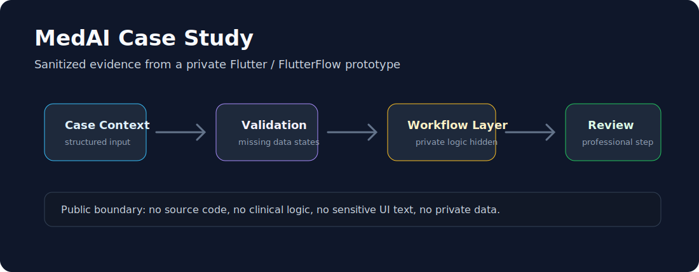

# MedAI Case Study

Public product case study for MedAI, focused on architecture, process, and lessons learned.



## Context

MedAI is a medical AI product initiative for specialized pediatric clinical workflows.

This repository is not the private product codebase. It is a public, sanitized case study describing product context, architecture thinking, workflow design, and lessons learned without exposing source code, clinical logic, sensitive content, or proprietary data.

## Topics

- problem framing;
- AI product architecture;
- data and workflow considerations;
- stakeholder communication;
- grant-backed product development;
- lessons from early-stage healthtech product work.

## Prototype Evidence

A private Flutter / FlutterFlow prototype archive was reviewed locally and used only to extract safe, high-level metadata for this public case study.

Publicly shared:

- framework and architecture notes;
- sanitized screen map;
- high-level product workflow;
- safety and privacy notes;
- lessons learned.

Intentionally not shared:

- source code;
- clinical decision logic;
- implementation details;
- private datasets;
- production configuration;
- sensitive UI text or screenshots.

## Structure

```text
docs/
  01-problem-context.md
  02-product-workflow.md
  03-architecture-notes.md
  04-lessons-learned.md
  05-prototype-overview.md
  06-flutter-app-structure.md
  07-privacy-and-safety-notes.md
```

## Published Notes

- [`docs/01-problem-context.md`](docs/01-problem-context.md)
- [`docs/02-product-workflow.md`](docs/02-product-workflow.md)
- [`docs/03-architecture-notes.md`](docs/03-architecture-notes.md)
- [`docs/04-lessons-learned.md`](docs/04-lessons-learned.md)
- [`docs/05-prototype-overview.md`](docs/05-prototype-overview.md)
- [`docs/06-flutter-app-structure.md`](docs/06-flutter-app-structure.md)
- [`docs/07-privacy-and-safety-notes.md`](docs/07-privacy-and-safety-notes.md)

## Status

Public sanitized case study. No private product code, clinical logic, or sensitive data is included.
