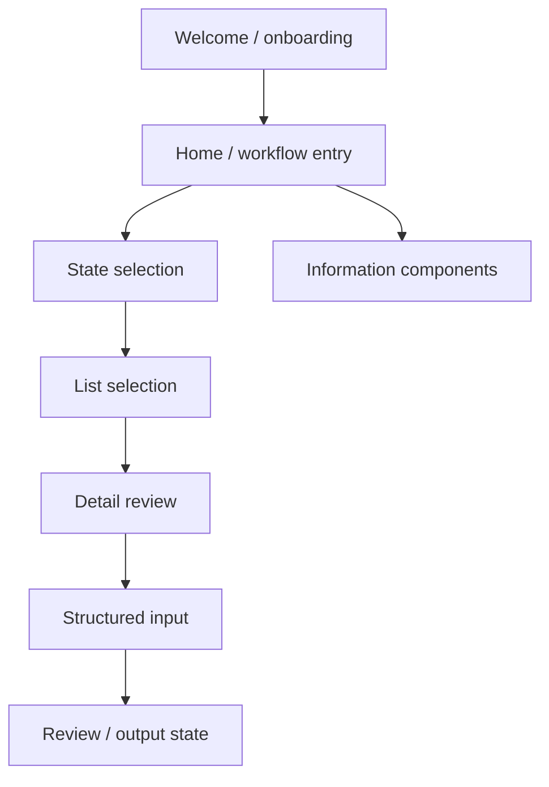

# Flutter App Structure

The private prototype follows a standard Flutter / FlutterFlow project layout.

```text
lib/
  main.dart
  app_state.dart
  index.dart
  pages/
  components/
  flutter_flow/

assets/
  images/
  fonts/
  pdfs/
  jsons/

ios/
android/
web/
test/
```

## High-Level Navigation



## Implementation Notes

- The project uses Flutter and Dart.
- Navigation is organized through named routes.
- UI is split into pages and reusable components.
- Generated FlutterFlow helper code is isolated under a framework utility folder.
- Platform folders exist for iOS, Android, and web.

## Public Boundary

This document describes structure only. It intentionally does not include source snippets, clinical logic, detailed UI text, or proprietary workflow rules.
